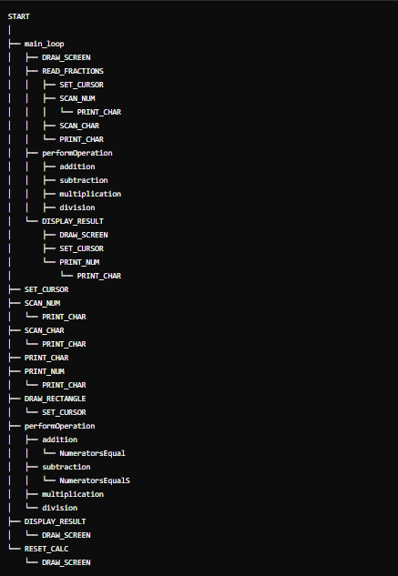
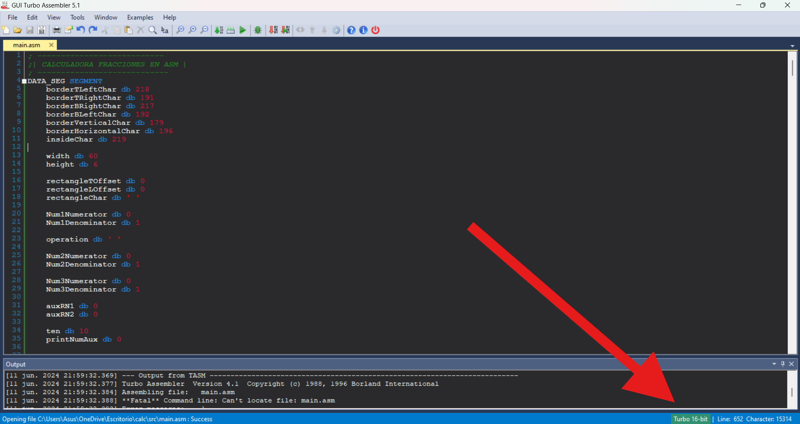
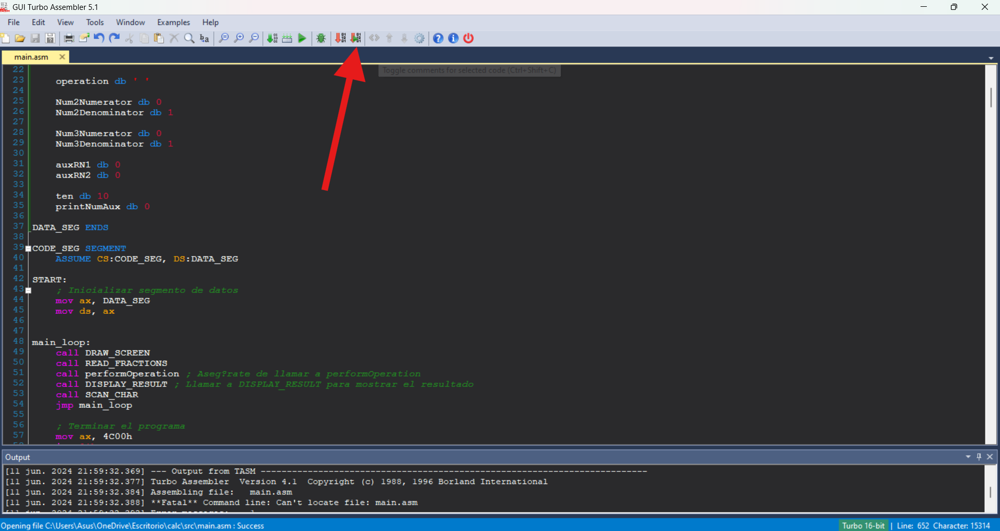

# Calculadora de Fracciones en Ensamblador

## Descripción del Proyecto

Este proyecto implementa una calculadora para operaciones con fracciones usando el lenguaje ensamblador. La calculadora permite realizar las cuatro operaciones aritméticas básicas (suma, resta, multiplicación y división) con números racionales. Se utiliza una interfaz simple que muestra las fracciones y los resultados en pantalla, interactuando mediante entradas del teclado.

## Objetivos

- Implementar una calculadora que trabaje con fracciones utilizando ensamblador.
- Emplear interrupciones del BIOS para gestionar la entrada y salida de datos.
- Crear una interfaz básica de usuario para la calculadora.
- Modularizar el código usando procedimientos (PROCs) para facilitar la lectura y el mantenimiento.

## Requisitos del Sistema

### Hardware
- Procesador compatible con x86.
- Monitor y teclado compatibles con BIOS.

### Software
- Ensamblador compatible.
- Emulador o entorno de desarrollo que soporte interrupciones del BIOS.

## Diseño del Sistema

### Diagrama de Bloques
Un diagrama de bloques básico podría ser útil para entender el flujo del programa. (Puedes incluir un diagrama aquí si lo tienes).

### Módulos del Sistema
1. **Entrada de Datos:** Maneja la entrada del teclado usando la interrupción INT 16H del BIOS.
2. **Operaciones Aritméticas:** Realiza las operaciones de suma, resta, multiplicación y división con fracciones.
3. **Salida de Datos:** Muestra los resultados en la pantalla usando la interrupción INT 10H del BIOS.
4. **Interfaz de Usuario:** Dibuja la calculadora en pantalla y administra la interacción con el usuario.

## Algoritmos Utilizados

### Algoritmo de Entrada de Datos
Utilizando la interrupción del BIOS INT 16H, se capturan las teclas presionadas por el usuario y se interpretan para obtener los números y la operación.

### Algoritmo de Operaciones Aritméticas
Se implementan las cuatro operaciones básicas, asegurando que las fracciones se manejen correctamente (por ejemplo, encontrando denominadores comunes para la suma y resta).

### Algoritmo de Salida de Datos
Utilizando la interrupción del BIOS INT 10H, se muestra el resultado en la pantalla de manera clara y organizada.

### Algoritmo de Dibujo de Pantalla
Se dibuja una interfaz simple que representa una calculadora en la pantalla, usando caracteres ASCII.

## Organigrama

## Compilación y Ejecución

1. **Compilación:**
   - Instalar GUI Turbo Assembler (TASM) de https://sourceforge.net/projects/guitasm8086/

2. **Ejecución:**
    - Abrir el archivo `main.ASM` en GUI Turbo Assembler.
    - Verificar que el modo esté en 16 bits.
    

    - Compilar y ensamblar el código.
    